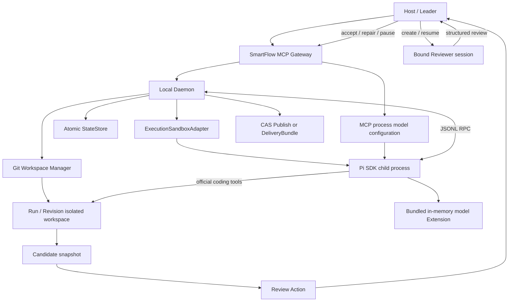
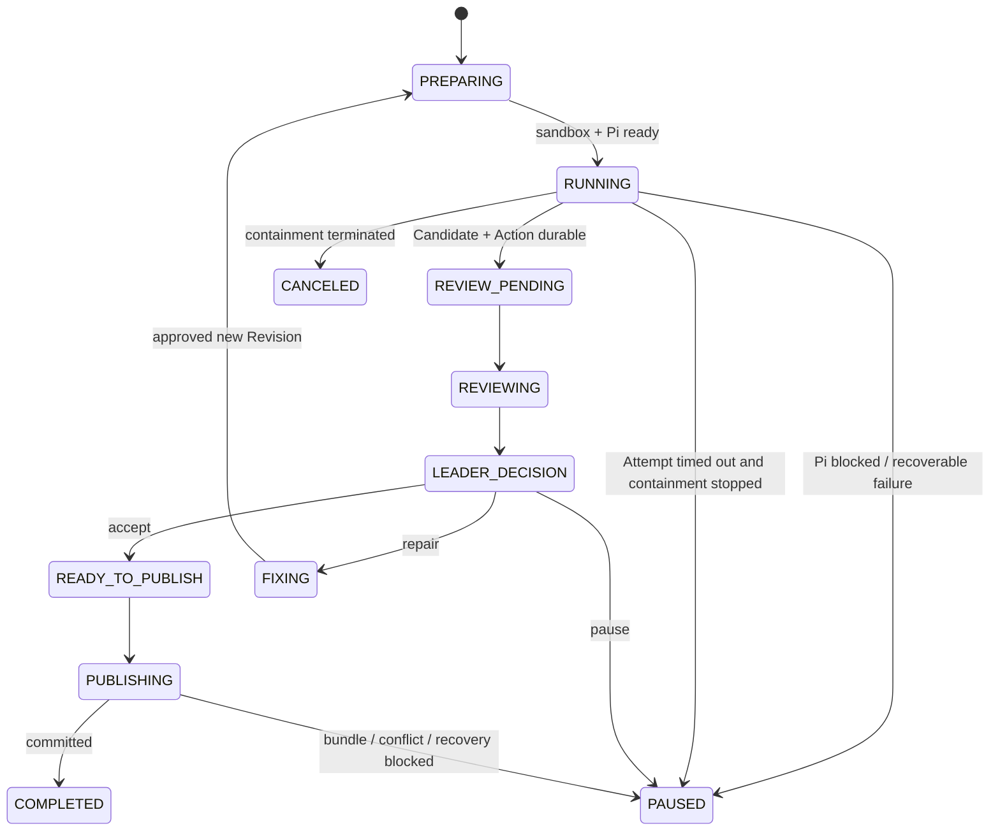

<!-- Authoring artifact only. SmartFlow runtime must not depend on Spec Kit or this file. -->

# SmartFlow MVP Implementation Plan

**Feature Branch**: `001-smartflow-mvp`  
**Version**: 4.0.0  
**Date**: 2026-08-05
**Scope**: Replace OpenCode and the custom Broker with a sandboxed Pi Coding Agent SDK Worker, register one MCP-configured model directly in memory without `models.json`, and preserve Task, Candidate, Review, Leader and Publish behavior.

## Summary

```text
Leader freezes tasks.md + Pi runtime config
→ Daemon creates Run/Revision and isolated Git workspace
→ ExecutionSandboxAdapter launches a Pi SDK child process
→ bundled Pi Extension registers the single MCP-configured model in memory
→ Daemon and Pi exchange JSONL RPC over stdin/stdout
→ Pi directly uses official read/bash/edit/write/grep/find/ls tools
→ Daemon snapshots the result and creates Candidate
→ Bound Reviewer returns structured Review to Leader
   ├─ accept → CAS Publish or DeliveryBundle
   ├─ repair → new Revision + new Pi session
   └─ pause
```

SmartFlow 不再代理文件操作或 Shell。安全性由整个 Pi Worker 进程树的 OS sandbox 保证：Pi 可以在当前 isolated workspace 内任意修改项目文件、执行任意 Shell 命令和访问网络；项目与用户数据访问不能越出该 workspace。运行所需的 Node.js、系统库和 Pi SDK 仅可只读访问，但原始项目、SmartFlow Data Dir 的其他内容、其他 Run workspace 和宿主用户数据不可见。

Host/Leader 继续持有 MCP 和用户交互。Pi Worker 不接收 SmartFlow MCP；当前迁移不动态注入 Host/global Skills。SmartFlow 不新增独立 verify/gate 阶段，Pi 可以按任务自行运行 test/lint/build。

MCP server 进程环境是唯一模型配置入口。每个 MCP server 实例只绑定一个 API endpoint 和一个模型；Daemon 冻结非敏感参数并把 API Key 仅通过子进程环境传入。Pi child 加载 SmartFlow 随包提供的静态 Extension，通过官方 `pi.registerProvider()` 在内存中注册模型。用户和 SmartFlow 均不维护、生成或读取 `models.json`。

## Technical Context

| 项目 | 决策 |
|---|---|
| Language | TypeScript，`strict: true` |
| Runtime | Node.js `>=22.19.0`，满足目标 Pi SDK 当前要求 |
| Package manager | pnpm workspace |
| Worker SDK | `@earendil-works/pi-coding-agent`，固定已验证 published version |
| Worker protocol | SDK RPC JSONL over child stdin/stdout |
| Model registration | Bundled Pi Extension + official `pi.registerProvider()`; in-memory only |
| MCP model config | One API/Base URL/model/API Key per MCP server instance |
| Supported model APIs | `openai-completions`、`openai-responses`、`anthropic-messages`、`google-generative-ai` |
| Model defaults | context `1000000`、max output `384000`、reasoning enabled、thinking `high` |
| Worker tools | Pi official `read`、`bash`、`edit`、`write`、`grep`、`find`、`ls` |
| Sandbox | Existing Darwin `ExecutionSandboxAdapter` extended for streaming child process containment |
| State | Project 外 Data Dir 的原子 `state.json` |
| Schema | Zod；运行时类型与协议来自同一 Schema |
| Snapshot | Run-scoped Git object store + Revision-scoped ordinary workspace/index |
| Transport | MCP Host ↔ local Daemon；Daemon ↔ Pi child JSONL RPC |
| Hash | SHA-256 + Canonical JSON |
| First platform | macOS；无可验证 Sandbox adapter 的平台 fail closed |
| Attempt timeout | MCP server 环境配置，计入 runtime config hash；超时终止 containment 并进入可恢复 PAUSED |

## Constitution Check

| 原则 | 计划结论 | 状态 |
|---|---|---|
| CP-001 Leader-only interaction | MCP 和用户交互留在 Host/Leader；Pi 不接 SmartFlow MCP | PASS |
| CP-002 Revision execution unit | TaskManifest v3 绑定 `runId + revisionId + tasksSha256` | PASS |
| CP-003 Pi config frozen | MCP server 环境是唯一来源；每个 Revision 绑定不含 API Key 的 `providerRuntimeConfigHash` | PASS |
| CP-004 fixed Pi/no fallback | Worker 固定 Pi；删除 OpenCode/Claude Worker，API/模型不 fallback | PASS |
| CP-005 process containment | Pi child 与全部子进程处于 workspace-scoped OS sandbox；无 Broker | PASS |
| CP-006 hidden running paths | 对外只返回逻辑 ID/Artifact，相对路径；不泄露 runtime 绝对路径 | PASS |
| CP-007 Candidate before Publish | Snapshot/Review/Publish 主线不变 | PASS |
| CP-008 Review gate | Candidate 直接 Review；无独立 verify/gate | PASS |
| CP-009 single writer | Run 状态原子更新；项目 Publish 串行 | PASS |
| CP-010 auditable attempt/session | Attempt 记录 Pi session 与 containment identity | PASS |
| CP-011 cancellation/timeout/recovery | Sandbox process tree 可终止；超时进入 `TIMED_OUT/PAUSED`；崩溃后按规则新建 Pi session | PASS |

**Gate**: PASS。MCP 单模型配置、内存注册和凭据边界不改变 Constitution 的 Leader、Pi、Sandbox、Review 或 Publish 权限；不得用兼容层保留 Broker、OpenCode、Provider 选择或模型配置文件。

## Architecture



### Responsibility boundaries

| 组件 | 保留/新增职责 | 明确不负责 |
|---|---|---|
| Host / Leader | 规划、用户审批、Review Action、Reviewer 创建/恢复、Leader 决策 | 不直接控制 Pi 文件工具 |
| MCP Gateway | 校验和转发短请求，隐藏内部绝对路径 | 不向 Pi 暴露 MCP；不保留 tool-decision API |
| Daemon | Run 状态机、Worker 生命周期、Attempt、取消、恢复、Review/Publish 协调 | 不代理文件/Shell 操作 |
| Git Workspace Manager | Baseline/Result Snapshot、Workspace 物化、Candidate diff、发布预检 | 不执行 Pi 工具调用 |
| ExecutionSandboxAdapter | 启动/终止受限进程树，提供 stdin/stdout/stderr 流和 containment identity | 不实现 Broker 权限策略 |
| Pi Provider | 校验/冻结 MCP 模型配置、启动 Pi RPC child、发送 prompt、归一化事件、保存 session Artifact | 不选择备用 Worker/API/模型；不重写官方 coding tools |
| Pi SDK child | 加载随包 Extension、内存注册一个模型、运行 Agent loop/官方工具 | 不读取 `models.json`、宿主用户 Pi 配置、原始项目或 SmartFlow 状态 |
| Review Bridge | ReviewBundle/Action、Reviewer provenance 与结构化结果校验 | 不自动发布 |
| Publish Service | 项目级串行、冲突预检、批量写回、DeliveryBundle | 不自动 merge/commit/push |

## Pi Worker Design

### Package boundary

新增 `packages/provider-pi/`，删除 `packages/provider-opencode/`、`packages/provider-claude-agent/` 和 `packages/execution-broker/`。

`provider-pi` 分为两侧：

1. Parent adapter：运行于 Daemon，校验冻结配置，通过 `ExecutionSandboxAdapter` 启动 child，处理 JSONL RPC 和 SDK 事件。
2. Child entry：运行于 Sandbox 内，导入 `@earendil-works/pi-coding-agent` 并进入 SDK RPC mode；同时加载随 `provider-pi` 发布的静态模型 Extension，以 MCP 环境配置调用官方 `pi.registerProvider()`。

Child 必须使用 SDK 官方 session/tool/resource loader。SmartFlow 可以设置 cwd、模型配置、任务 prompt、session 目录和资源发现范围，但不能复制、包装或替换官方文件工具实现。

### Direct MCP model registration

MCP server 启动配置是唯一用户输入，必填字段为：

```text
SMARTFLOW_PI_API
SMARTFLOW_PI_BASE_URL
SMARTFLOW_PI_MODEL
SMARTFLOW_PI_API_KEY
```

`SMARTFLOW_PI_API` 只接受 `openai-completions`、`openai-responses`、`anthropic-messages` 和 `google-generative-ai`。可选字段 `SMARTFLOW_PI_CONTEXT_WINDOW`、`SMARTFLOW_PI_MAX_TOKENS`、`SMARTFLOW_PI_THINKING`、`SMARTFLOW_PI_ATTEMPT_DEADLINE_MS` 分别默认 `1000000`、`384000`、`high`、`1800000`。模型注册固定 `reasoning: true` 和 `input: ["text"]`；`SMARTFLOW_PI_THINKING=off` 可关闭当前 session 的推理。

Daemon 解析并冻结除 API Key 外的配置。Child 只收到最小环境和一个固定内部注册 ID（例如 `smartflow-mcp`）；该 ID 是 Pi Extension API 的实现细节，不是 SmartFlow Provider 字段，不进入 TaskManifest、Run state 或 MCP 配置。Extension 使用环境变量引用解析 API Key，在内存中注册一个模型，然后由官方 RPC 通过固定内部 ID 和冻结 model ID 选择该模型。

以下字段完全删除且不兼容：`SMARTFLOW_WORKER`、`SMARTFLOW_MODEL_API_FORMAT`、`SMARTFLOW_MODEL_API_KEY`、`SMARTFLOW_MODEL_BASE_URL`、`SMARTFLOW_MODEL`、`SMARTFLOW_PI_PROVIDER`、`SMARTFLOW_PI_CREDENTIAL_ENV`。SmartFlow 不提供旧字段 fallback。

不得创建、读取或探测用户/Run 的 `models.json`。API Key 不进入 argv、runtime hash、Manifest、Run state、session、Artifact、日志或错误；Daemon 仅可使用 Key 摘要计算进程配置指纹，以便凭据轮换触发正确重连/重启。

### RPC lifecycle

```text
Daemon creates WorkerAttempt(PREPARING)
→ Sandbox spawns Pi child and returns containment identity
→ child loads bundled Extension and registers one frozen MCP model in memory
→ child emits ready/session metadata
→ Daemon sends frozen task prompt
→ child streams assistant/tool/session events
→ provider maps events to WorkerEvent
→ terminal complete | blocked | failed | timed_out | canceled
→ Daemon persists PiSessionArtifact
→ terminate/reconcile process tree
→ remove/exclude .smartflow-runtime
→ capture Result Snapshot and Candidate
```

JSONL stdout 只承载 RPC。诊断写 stderr，经现有日志脱敏后保存。协议行解析失败、child 非预期退出或 runtime config hash 不匹配均结束当前 Attempt，不得在宿主进程内继续执行 SDK。

### Prompt and resource scope

Worker prompt 只包含：

- 冻结 TaskSourceArtifact/TaskManifest 的任务内容；
- 当前 Revision 与上一轮结构化 RepairItems（如有）；
- cwd 是唯一项目工作区，允许修改其中任意项目文件；
- 不直接询问用户，无法继续时以结构化 blocked/failed 结果结束。

Pi ResourceLoader 必须以 isolated workspace 为项目 cwd，并把 user/global resource discovery 指向 Run-local runtime area 或关闭。项目本地资源若已存在于 workspace，可按 Pi 官方发现规则加载；不得读取宿主用户级 Pi/Codex/Claude Skill 目录，也不通过 MCP 动态注入 Skills。

### Runtime configuration

TaskManifest v3 只保存 `providerRuntimeConfigHash`，不保存 Provider 字段。哈希覆盖会改变 Agent 行为的稳定配置：API、Base URL、模型标识、context、max output、思考参数、Attempt 运行时限和资源加载选项；凭据本身不写入 Manifest、状态、session、Artifact 或日志。

Daemon 只向 child 传递运行所需最小环境：模型凭据、Run-local runtime 路径和基础进程环境。不得传递原始项目路径、SmartFlow Data Dir 根路径、其他 Run 路径或无关敏感环境变量。

## Sandbox and Workspace Boundary

### Required adapter extension

现有一次性命令执行接口需要增加受管 streaming child 能力，概念接口如下：

```ts
interface SandboxedProcessHandle {
  containmentId: string;
  pid: number;
  stdin: WritableStream;
  stdout: ReadableStream;
  stderr: ReadableStream;
  wait(): Promise<SandboxedProcessExit>;
  terminate(): Promise<void>;
}

interface ExecutionSandboxAdapter {
  spawn(request: SandboxedSpawnRequest): Promise<SandboxedProcessHandle>;
}
```

实际 TypeScript 名称可在实现中调整，但必须保留四个契约：可双向流式通信、稳定 containment identity、终止完整进程树、等待并对账退出事实。

### Filesystem policy

- Read/write project data: only current Revision workspace root.
- Read-only bootstrap: Node.js、必要系统库和已安装 Pi SDK 文件的最小路径集合。
- Denied: original project root、SmartFlow project Data Dir（除 Pi-visible runtime 子目录）、其他 Run workspace、用户 HOME 数据和任意额外宿主目录。
- Symlink/absolute path/subprocess escape: denied by OS sandbox, not by prompt or JavaScript path checking.
- Network: allowed.
- Shell command/child process choice: unrestricted inside the containment boundary.

Sandbox profile 由 Daemon 基于已解析的明确路径生成。路径必须先验证为当前 Run/Revision 所有，不能使用未解析 glob 或用户任务内容扩展权限。

### External path non-disclosure

Pi child 内部可以知道自己的 workspace cwd，但该绝对路径是运行细节。Worker event normalization、日志脱敏和 MCP/API/UI serialization 必须把 workspace、SmartFlow 状态、Run runtime 和 session 绝对路径替换为 `jobId`、Artifact ID 或项目相对路径。SDK error、stack trace 和 Shell 输出适用同一规则；Finalize Artifact 可以被列出，但不得包含内部绝对路径。

### Run-local Pi runtime

Pi session、settings/cache 和临时内容放在 `<revision-workspace>/.smartflow-runtime/`。该目录只服务当前 Attempt：

- Worker 运行时允许读写；
- Attempt 结束后，Daemon 将需要保留的 session 元数据写成 Data Dir Artifact；
- Result Snapshot/Candidate 明确排除该目录；
- 进程对账完成后删除该目录；
- 目录损坏或丢失只影响 Pi session 恢复，不改变 `state.json`、Task、Snapshot 或 Candidate 事实。

## Session, Recovery and Cancellation

| 场景 | job / Revision / workspace | Pi session | 处理 |
|---|---|---|---|
| Host/UI 断开后重连，Daemon 与 Worker 存活 | 相同 | 相同 | 查询/等待同一 job，不重启 Worker |
| 同一活跃 Attempt 内 Daemon 继续驱动 | 相同 | 相同 | 继续 JSONL RPC |
| Pi child 崩溃，Revision 可恢复 | 相同 | 新 session + 新 attempt | 复用相同 Revision workspace，旧 attempt 标 failed |
| Daemon/主机崩溃，旧进程已不可证明存活 | 相同 | 新 session + 新 attempt | 先对账/终止旧 containment，再恢复 |
| Leader 批准同一 Task repair/补充 | 新 Revision，以上一 Result Tree 物化 | 新 session | 保留 Reviewer binding |
| 用户提出独立新功能 | 新 Task/Run/workspace | 新 session | Leader 创建新执行单元 |
| 用户取消 | 相同 | 终止 | kill containment tree，durable 写 canceled |
| Attempt 达到冻结 deadline | 相同 | 终止并失效 | kill containment tree，durable 写 `TIMED_OUT`，Run 进入可恢复 `PAUSED` |

“同一 Task 还是新功能”只由 Leader 根据用户意图分类。Pi session 不承担跨 Revision 业务记忆；Task Artifact、RepairItems、Snapshot 和 Review history 才是恢复输入。

## State and Protocol Migration

### TaskManifest v3

```ts
interface TaskManifestV3 {
  schemaVersion: 3;
  runId: string;
  revisionId: string;
  providerRuntimeConfigHash: string;
  taskSourceArtifact: ArtifactRef;
  tasksSha256: string;
}
```

删除 `permissionPolicy`、`permissionPolicyHash`、OpenCode/Claude provider union 和 Broker tool definitions。

### Run state

Run 增加或统一为 `workerAttempts[]`，每个 Attempt 至少包含：

```ts
interface PiWorkerAttemptState {
  attemptId: string;
  revision: number;
  generation: number;
  status: "PREPARING" | "RUNNING" | "COMPLETED" | "BLOCKED" | "FAILED" | "TIMED_OUT" | "CANCELED";
  piSessionId?: string;
  containmentId?: string;
  processIdentity?: ProcessIdentity;
  sessionArtifact?: ArtifactRef;
  startedAt: string;
  endedAt?: string;
}
```

删除状态字段：`brokerSession`、`effectExecutions`、`managedProcesses`、`workerBlock` 及其 answer/receipt。进程恢复信息进入当前 PiWorkerAttempt；一般阻塞以 Attempt terminal reason 和 Run `PAUSED` 表示，由 Leader 决定是否创建新 Revision。

### MCP surface

保留 execute/status/wait/result/cancel/resume、Review Action 和 Leader decision 工具。删除 `smartflow_submit_tool_decision`、`workerBlockAnswer` 输入和 Host action loop 中的 Worker 工具审批分支。所有 MCP 输出在 schema 序列化前执行内部绝对路径脱敏。

`resume` 只恢复 Run 状态或启动已批准 Revision；它不接受任意 Pi tool answer，也不直接向 Pi session 注入用户消息。

### State compatibility

4.0 是不兼容状态升级。启动时如发现含 Broker/OpenCode 字段的旧 Active Run，Daemon 必须以明确 unsupported migration 状态停止，不尝试把旧 effect/session 转成 Pi session。已终态 Audit Artifact 可保留为只读历史，但不参与 4.0 恢复。

## Git Workspace, Candidate and Publish

现有 Git-backed 设计保持：

- Run Baseline 在整个 Run 内固定；Revision 1 使用 Baseline，后续 Revision 使用上一 Result Tree。
- 形式 Candidate 是 Baseline 到最新 Result Tree 的累计变化；相邻 Tree diff 只作为本轮 repair evidence。
- 每个 Run 使用独立 append-only Git object store，每个 Revision 使用独立 index/workspace/snapshot。
- Pi 不接触用户仓库 index、refs 或 Worktree；SmartFlow 不使用 `git worktree add`。
- Git capability probe 不检测或阻断 Git LFS、`.gitattributes` 与自定义 `clean`/`smudge`/`process` filter；workspace 内容按普通文件流程读写。
- Publish 只检查累计 Candidate paths，要求 expected-old-hash、稳定 operationId、结果查询和支持的 batch mode。
- 冲突返回 `0/N` 与 DeliveryBundle；PARTIAL/UNKNOWN 进入 `PUBLISH_RECOVERY_BLOCKED`。

Pi runtime directory 必须在 Result Snapshot 之前清理/排除，因此不会出现在 Candidate changed paths、ReviewBundle 或 Publish。

## Data Directory and Durability

```text
<user-data>/smartflow/projects/<projectId>/
├── lock
├── state.json
├── events.jsonl
└── runs/<jobId>/
    ├── task-source.md
    ├── task-manifest.json
    ├── baseline.json
    ├── git/objects/
    ├── attempts/<attemptId>/
    │   ├── session-artifact.json
    │   └── logs/
    ├── revisions/<revision>/
    │   ├── index
    │   ├── input-snapshot.json
    │   ├── result-snapshot.json
    │   ├── workspace/
    │   │   └── .smartflow-runtime/  # active attempt only; excluded/cleaned
    │   ├── candidate/
    │   └── review/
    └── delivery/
```

`state.json` 继续是唯一恢复事实。Artifact durable-first，随后通过 Project lock、revision/CAS 和原子 replace 提交状态。`events.jsonl` 只用于审计。

## State Machine Impact

主状态机不新增通用阶段。变化限定为 Worker 子状态：



不再存在 `WORKER_BLOCKED`/tool-decision 中间协议。Pi 无法继续时结束 Attempt，Daemon 将结构化原因写入 Run 并回到 Leader。

## Source Layout Changes

```text
packages/
├── provider-pi/                 # SDK parent adapter + sandbox child + bundled model Extension
├── provider-core/               # keep minimal WorkerProvider/event contract
├── workspace/                   # extend sandbox streaming process API
├── protocol/                    # provider/session/state/MCP schema v4
├── state-store/                 # PiWorkerAttempt persistence/recovery
├── task-manifest/               # TaskManifest v3, provider="pi"
├── review/                      # retained
├── publish/                     # retained
├── provider-opencode/           # delete
├── provider-claude-agent/       # delete
└── execution-broker/            # delete

apps/
├── daemon/                      # Pi composition, lifecycle, recovery/cancel
├── mcp-server/                  # remove tool-decision surface
├── host-skill/                  # remove Worker block/tool approval branch
└── cli/                         # Pi doctor/installed gate
```

同时更新 workspace manifests、root dependencies/scripts、bundle entry points 和安装产物，确保发布包不再包含 OpenCode binary/dependency、Broker 或 Claude placeholder。

## Implementation Phases

| 阶段 | 内容 | 完成标准 |
|---|---|---|
| P0 — Contract freeze | 更新 TaskManifest、Run state、MCP 和 Pi Worker contracts | schema v3/v4 可表达 Attempt/session/containment/timeout/path redaction；无 Broker 字段 |
| P1 — Sandbox streaming | 为 ExecutionSandboxAdapter 增加双向流、deadline、完整进程树取消和 path-containment tests | workspace 内命令/网络可用；受保护用户路径不可读写；超时后零存活进程 |
| P2 — Pi Provider | 新增 provider-pi parent/child、MCP 单模型内存注册 Extension、配置 hash、RPC 和事件归一化 | 四种标准 API 均可注册一个模型且不读写 `models.json`；真实 Pi session 可在 isolated workspace 完成 add/modify/delete/shell |
| P3 — Daemon integration | 接入 registry/runner/recovery/cancel/state，删除 Worker tool-decision 流 | 重连/崩溃/新 Revision 的 session matrix 全部通过 |
| P4 — Legacy deletion | 删除 execution-broker、provider-opencode、provider-claude-agent 及依赖/状态/协议残留 | 全仓 `rg` 对遗留运行代码命中为 0 |
| P5 — Review/Publish regression | 更新 contract/integration/security/crash/e2e tests | Candidate、Reviewer binding、冲突发布和取消恢复保持通过 |

P0→P1→P2 是阻塞链；P3 依赖 P0–P2；P4 在 Pi 主线接通后立即执行；P5 收敛全链路。不得保留双 Provider feature flag 或 Broker compatibility adapter。

## Test Strategy

### Contract

- Worker 只接受 Pi；TaskManifest v3 只绑定 runtime config hash，不含 Provider 字段。
- MCP 模型配置只接受四种 API、单模型和直接 API Key；默认值与合法覆盖均可冻结。
- MCP surface 不含 `smartflow_submit_tool_decision` 或 workerBlock answer。
- Run state 拒绝 Broker/effect/managedProcess 旧字段，接受 PiWorkerAttempt/session Artifact。
- MCP/API/UI/log serialization 不暴露 workspace、状态或 session 绝对路径。

### Integration

- Pi SDK child 的 JSONL ready/prompt/event/terminal 流。
- Bundled Extension 从 MCP 环境直接注册模型；四种 API 各完成一次无网络模型解析，且运行前后不存在 `models.json`。
- add/modify/delete/search/shell 的 Candidate 结果。
- Host 重连同 session；child crash 新 attempt/session；new Revision 新 session。
- Pi config hash 漂移 fail closed。

### Security

- workspace 内任意项目路径读写成功，包括 `tasks.md` 和 `.specify`。
- 原始项目、SmartFlow 状态、其他 Run workspace、用户敏感目录访问失败。
- absolute path、symlink 和 subprocess escape 失败。
- Shell 与网络不被 Broker 或逐命令策略拦截。
- 已知绝对路径 canary 不出现在 Worker events、MCP payload、UI data、日志或 Finalize Artifact。
- API Key canary 不出现在 argv、runtime hash、Manifest、Run state、session、Artifact、日志或错误；宿主和 workspace `models.json` 均不被读取/生成。

### Crash and cancellation

- kill child、kill daemon、host reconnect、deadline timeout、cancel 进程树对账。
- session runtime 丢失后仍可从 `state.json`、Revision 和 workspace 创建新 attempt。
- 不重复 Candidate、Review Action 或 Publish。

### End-to-end

- Installed package: Task → real Pi → Candidate → Review → Leader accept → Publish。
- Repair: new Revision/new Pi session，same Reviewer binding，累计 Candidate 正确。
- Publish conflict: overlapping Runs 第二个 `0/N`。

删除代码时同步删除其专属测试：Broker effect/policy/receipt、OpenCode capability/live-provider、Claude placeholder、Worker tool-decision tests。只为新的行为契约写测试；不为 prompt、Docker 或常量数据单独写单元测试。

## Acceptance Gate

实现完成必须同时满足：

1. `@earendil-works/pi-coding-agent` 是唯一 Worker SDK，依赖版本与 Node 要求已固定。
2. Pi 使用官方 coding tools；SmartFlow 文件/Shell Broker、effects 和 tool-decision 代码为零。
3. Pi 及全部子进程只能访问当前 isolated workspace 的项目数据；原始项目和 SmartFlow 状态不可访问。
4. 任意 workspace-local Shell 与网络可用，且无逐命令授权流程。
5. Candidate、Review、Leader 和 Publish 行为通过现有回归契约。
6. Session matrix、取消和崩溃恢复测试通过。
7. Timeout 后完整进程树退出、Attempt 为 `TIMED_OUT`，且 Leader 恢复前无新 Candidate/Attempt。
8. MCP/API/UI/log/Finalize Artifact 的内部绝对路径泄露数为 0。
9. 发布包、CLI doctor、scripts、workspace manifests 和测试名称不再包含 OpenCode/Claude/Broker 主线。
10. MCP 配置是唯一模型配置源；四种标准 API 可各自内存注册恰好一个模型，默认 1M/384K/high 生效，且 `models.json` 读写数和 API Key 泄露数均为 0。

## Upstream References

- Pi Coding Agent SDK: https://github.com/earendil-works/pi/blob/main/packages/coding-agent/docs/sdk.md
- Pi Coding Agent RPC: https://github.com/earendil-works/pi/blob/main/packages/coding-agent/docs/rpc.md
- Pi Coding Agent Extensions: https://github.com/earendil-works/pi/blob/main/packages/coding-agent/docs/extensions.md#piregisterprovidername-config
- Pi Agent Core: https://github.com/earendil-works/pi/blob/main/packages/agent/README.md
- Pi Coding Agent package metadata: https://github.com/earendil-works/pi/blob/main/packages/coding-agent/package.json
