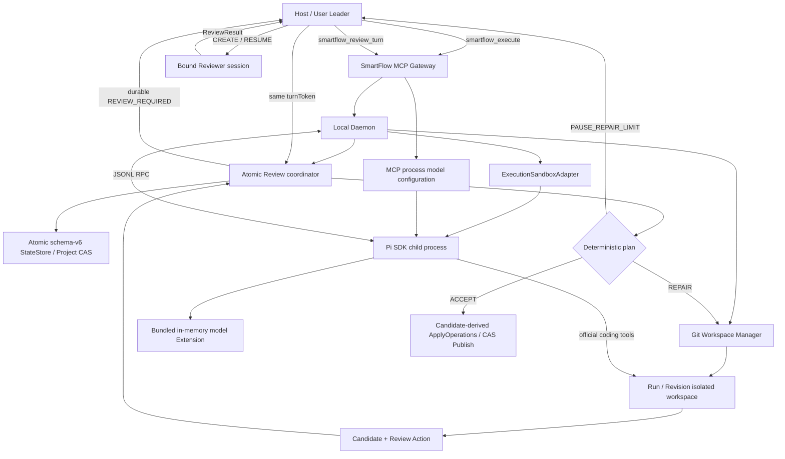
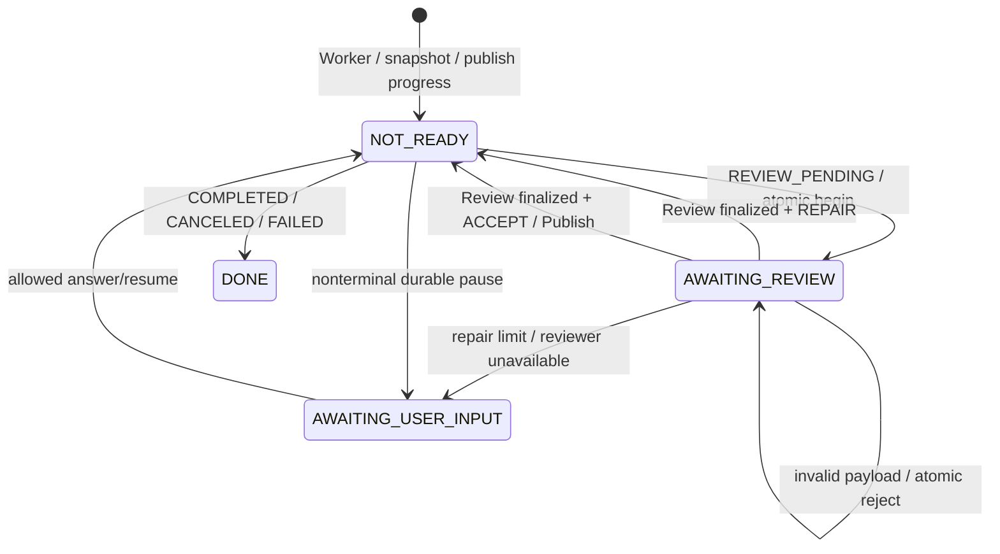

<!-- Authoring artifact only. SmartFlow runtime must not depend on Spec Kit or this file. -->

# SmartFlow MVP Implementation Plan

**Feature Branch**: `001-smartflow-mvp`
**Version**: 4.1.0
**Date**: 2026-08-11
**Scope**: Preserve the sandboxed Pi Worker and safe Git Candidate/Publish path while moving deterministic Review mechanics into the Daemon behind the sole public `smartflow_review_turn` continuation API.

## Summary

```text
Host freezes tasks.md + Pi runtime config
→ smartflow_execute
→ Daemon creates Run/Revision and isolated Git workspace
→ Sandbox launches Pi SDK child; bundled Extension registers one model
→ Pi uses official read/bash/edit/write/grep/find/ls tools
→ Daemon snapshots Result and creates Candidate/Review Action
→ Host calls smartflow_review_turn
   ├─ NOT_READY → bounded poll
   ├─ REVIEW_REQUIRED → Host CREATE/RESUME bound Reviewer
   │                    → submit ReviewResult with same turnToken
   │                    → Daemon plan:
   │                       ├─ ACCEPT → deterministic Publish
   │                       ├─ REPAIR → all nested issues → new Revision/new Pi session
   │                       └─ PAUSE_REPAIR_LIMIT
   │                    invalid payload → atomic reject; Run remains AWAITING_REVIEW
   ├─ USER_INPUT_REQUIRED → Host/user typed answer
   └─ DONE → terminal result
```

SmartFlow 不代理文件操作或 Shell。安全性由整个 Pi Worker 进程树的 OS sandbox 保证：Pi 可以在当前 isolated workspace 内修改项目文件、执行 Shell 和访问网络；原始项目、SmartFlow Data Dir 的其他内容、其他 Run workspace 和宿主用户数据不可见。

职责按能力拆分：Host/Leader 持有 MCP、独立 Reviewer CREATE/RESUME 与所有用户交互；Daemon 持有可冻结、可恢复的机械编排，包括 bounded poll、原子 Review begin/finalize、确定性 accept/repair/pause、同范围 repair continuation 和 Publish。Daemon 不创建 Reviewer，不解释开放式用户意图，也不扩大 Task 范围。Pi Worker 不接收 SmartFlow MCP；SmartFlow 不新增独立 verify/gate。

MCP server 进程环境仍是唯一模型配置入口。每个实例只绑定一个 API endpoint 和模型；API Key 只通过子进程环境传入。Pi child 加载静态 Extension，通过官方 `pi.registerProvider()` 内存注册模型，不生成或读取 `models.json`。

`smartflow_execute → smartflow_review_turn*` 是唯一公开 Review orchestration。Review turn 公开四态并在 schema-v6 `RunRecord.hostTurn` 中持久化两阶段 checkpoint；启动时幂等迁移可支持的 legacy state。公共 MCP surface 恰好六个工具：execute、review-turn，以及四个独立 Run-management APIs status/resume/cancel/result。后四者不是 Review continuation 或第二条 Review 编排路径；公开 resume 只用于独立 paused-Run recovery，不能代答或绕过 active `hostTurn` ownership。旧 wait/claim/renew/submission/Leader primitive symbols、schemas、handlers、registrations、aliases 均不存在；Review begin/finalize 是原子 Daemon domain operations。`REVIEW_REQUIRED` 可向 owning Host 暴露 Reviewer worktree；发布相关 `USER_INPUT_REQUIRED` 可提供已审核 Candidate worktree，以便用户外部人工合并后请求目标确认。设计细节见 [adr-daemon-owned-review-turn.md](adr-daemon-owned-review-turn.md) 与 [contracts/review-turn.md](contracts/review-turn.md)。

## Technical Context

| 项目 | 决策 |
|---|---|
| Language | TypeScript，`strict: true` |
| Runtime | Node.js `>=22.19.0`，满足目标 Pi SDK 当前要求 |
| Package manager | pnpm workspace |
| Worker SDK | `@earendil-works/pi-coding-agent`，固定已验证 published version |
| Worker protocol | SDK RPC JSONL over child stdin/stdout |
| Model registration | Bundled Pi Extension + official `pi.registerProvider()`; in-memory only |
| MCP model config | One API/Base URL/model/API Key per MCP server instance |
| Supported model APIs | `openai-completions`、`openai-responses`、`anthropic-messages`、`google-generative-ai` |
| Model defaults | context `1000000`、max output `384000`、reasoning enabled、thinking `high` |
| Worker tools | Pi official `read`、`bash`、`edit`、`write`、`grep`、`find`、`ls` |
| Sandbox | Existing Darwin `ExecutionSandboxAdapter` extended for streaming child process containment |
| State | Project 外、未版本化的 `<user-data>/smartflow` 下 SQLite `state.sqlite` 保存唯一 schema-v6 恢复事实并原地保留 v4/v5 migration；Run 含 durable `hostTurn`/`autoRepairRounds`/`noProgressCount` 与通用 `recovery.repairRound`、Publish attempt/precheck 和人工确认 marker |
| Schema | Zod；唯一 ReviewResult/TaskReview/Issue runtime contract；durable Review/Leader artifacts 固定 schemaVersion 2；运行时类型与协议来自同一 Schema |
| Snapshot | Run-scoped Git object store + Revision-scoped ordinary workspace/index |
| Host protocol | Sole public Review orchestration: `smartflow_execute → smartflow_review_turn*`; four ReviewTurn states; exactly 6 public MCP tools |
| Concurrency | Project-wide stateVersion CAS + stable child request IDs + atomic Review domain operations |
| Transport | MCP Host ↔ local Daemon；Daemon ↔ Pi child JSONL RPC |
| Hash | SHA-256 + Canonical JSON |
| First platform | macOS；无可验证 Sandbox adapter 的平台 fail closed |
| Attempt timeout | MCP server 环境配置，计入 runtime config hash；超时终止 containment 并进入可恢复 PAUSED |

## Constitution Check

| 原则 | 计划结论 | 状态 |
|---|---|---|
| CP-001 Leader-only interaction | Host 独占 Reviewer 执行/用户交互；Daemon 只执行冻结的确定性 mechanics；Pi 不接 SmartFlow MCP | PASS |
| CP-002 Revision execution unit | TaskManifest v3 绑定 `runId + revisionId + tasksSha256 + enabledTaskIds`，enabled set 冻结且唯一 | PASS |
| CP-003 Pi config frozen | MCP server 环境是唯一来源；每个 Revision 绑定不含 API Key 的 `providerRuntimeConfigHash` | PASS |
| CP-004 fixed Pi/no fallback | Worker 固定 Pi；删除 OpenCode/Claude Worker，API/模型不 fallback | PASS |
| CP-005 process containment | Pi child 与全部子进程处于 workspace-scoped OS sandbox；无 Broker | PASS |
| CP-006 controlled running paths | Durable `AWAITING_REVIEW` 的 `REVIEW_REQUIRED` 向 owning Host 暴露 Reviewer worktree；仅 `PUBLISH_ADAPTER_UNAVAILABLE`、`PUBLISH_PRECHECK_CONFLICT` 或后续人工确认不匹配的发布 `USER_INPUT_REQUIRED` 可提供同一已审核 Candidate worktree；其他输出只含逻辑 ID/相对路径/Artifact | PASS |
| CP-007 Candidate before Publish | Snapshot/Candidate → DurableReviewDecisionV2/DurableLeaderDecisionV2 → Publish 的 hash-bound evidence chain 保持 | PASS |
| CP-008 Review gate | `manifest.enabledTaskIds` 精确覆盖、全部 Task 100% 且 issues 为空时 Daemon 才自动 accept；否则只按全部嵌套 issues 与 15 轮预算 repair/pause，非法 payload 原子拒绝 | PASS |
| CP-009 single writer/CAS/Host ownership | Project CAS、stable child IDs、atomic transitions 与 durable `hostTurnId + turnToken` | PASS |
| CP-010 auditable attempt/session | Attempt 记录 Pi session/containment；Run 记录 Host turn、自动 decision 和用户 answer | PASS |
| CP-011 cancellation/timeout/recovery | Sandbox tree 可终止；Host-turn recovery 优先且重读 fresh state；旧 recovery 不并发 | PASS |

**Gate**: PASS。MCP 单模型配置、内存注册和凭据边界不改变 Constitution 的 Leader、Pi、Sandbox、Review 或 Publish 权限；不得用兼容层保留 Broker、OpenCode、Provider 选择或模型配置文件。

## Architecture



### Responsibility boundaries

| 组件 | 保留/新增职责 | 明确不负责 |
|---|---|---|
| Host / User Leader | Task/user approval、稳定 hostTurn identity、Reviewer CREATE/RESUME、向用户展示 typed pause 并提交 answer | 不重建 Review decision/Publish mechanics；不直接控制 Pi tools |
| MCP Gateway | 校验并转发六个公开工具；`execute → review-turn*` 是唯一公开 Review 编排；隐藏非 `AWAITING_REVIEW` 内部路径 | 不向 Pi 暴露 MCP；旧 wait/claim/renew/review/decision primitive APIs 不存在；不自行保存状态 |
| HostTurnCoordinator | bounded poll、原子 begin/finalize、owner/token 校验、typed pause、单 deadline/restart recovery | 不创建 Reviewer、不询问用户、不扩大 Repair scope |
| Daemon runtime | Project CAS、Run/Pi lifecycle、Attempt、取消、repair Revision、Publish progression；Host-turn checkpoint 优先恢复 | 不代理文件/Shell；checkpoint 存在时不并行 ordinary Run recovery |
| StateStore / ProjectMutationExecutor | schema-v6 state、legacy migration、stateVersion CAS、request receipt/idempotency、atomic replace、Publish attempt/precheck/manual-confirmation evidence | 不从 events/timers/session 推断事实 |
| Git Workspace Manager | Baseline/Result Snapshot、Workspace 物化、Candidate diff、发布预检 | 不执行 Pi 工具调用 |
| ExecutionSandboxAdapter | 启动/终止受限进程树，提供 streams 与 containment identity | 不实现 Broker 权限策略 |
| Pi Provider | 冻结配置、启动 RPC child、归一化事件、保存 session evidence | 不选择备用 Worker/API/模型；不重写 official tools |
| Pi SDK child | 加载 Extension、内存注册一个模型、运行 Agent loop/official tools | 不读 `models.json`、Host MCP、原始项目或其他 Run state |
| Bound Reviewer | 读取 bound workspace 中同步 Task/current full result，对 `manifest.enabledTaskIds` 中每个 Task 给出唯一 `TaskReview`，并以项目相对文件 issue 描述具体函数/行为、触发条件和影响 | 不调用 SmartFlow mechanics、不 Publish、不直接询问用户；只输出 strict ReviewResult |
| Review policy | 仅 `ACCEPT | REPAIR | PAUSE_REPAIR_LIMIT`，15-round counter；REPAIR 消费当前 ReviewResult 的全部嵌套 issues；no-progress 只按 failure/task/path scope 严格缩小或相关 Candidate 文件内容变化判定 | 不创建/筛选/改写 Issue，不接受 Leader-authored repair，不从非法 payload 生成 pause |
| Publish Service | 从绑定 Candidate、同 Revision 的 immutable `REVISION_RESULT` 和 Run Git object store 确定性派生/读取 ApplyOperation blob；执行 capability probe、项目 lease、全路径 preflight、stable operation ID、attempt/result journal、query recovery 与只读人工确认 | 不自动 merge/commit/push；preflight 通过前不创建 `PREPARED` attempt；不以人工确认绕过 PARTIAL/UNKNOWN/recovery block |

## Pi Worker Design

### Package boundary

新增 `packages/provider-pi/`，删除 `packages/provider-opencode/`、`packages/provider-claude-agent/` 和 `packages/execution-broker/`。

`provider-pi` 分为两侧：

1. Parent adapter：运行于 Daemon，校验冻结配置，通过 `ExecutionSandboxAdapter` 启动 child，处理 JSONL RPC 和 SDK 事件。
2. Child entry：运行于 Sandbox 内，导入 `@earendil-works/pi-coding-agent` 并进入 SDK RPC mode；同时加载随 `provider-pi` 发布的静态模型 Extension，以 MCP 环境配置调用官方 `pi.registerProvider()`。

Child 必须使用 SDK 官方 session/tool/resource loader。SmartFlow 可以设置 cwd、模型配置、任务 prompt、session 目录和资源发现范围，但不能复制、包装或替换官方文件工具实现。

### Direct MCP model registration

MCP server 启动配置是唯一用户输入，必填字段为：

```text
SMARTFLOW_PI_API
SMARTFLOW_PI_BASE_URL
SMARTFLOW_PI_MODEL
SMARTFLOW_PI_API_KEY
```

`SMARTFLOW_PI_API` 只接受 `openai-completions`、`openai-responses`、`anthropic-messages` 和 `google-generative-ai`。可选字段 `SMARTFLOW_PI_CONTEXT_WINDOW`、`SMARTFLOW_PI_MAX_TOKENS`、`SMARTFLOW_PI_THINKING`、`SMARTFLOW_PI_ATTEMPT_DEADLINE_MS` 分别默认 `1000000`、`384000`、`high`、`300000`。最后一项是由 Pi child 每 30 秒 heartbeat 续期的滚动窗口，不限制 Attempt 总时长，合法覆盖值不得低于 `60000`。模型注册固定 `reasoning: true` 和 `input: ["text"]`；`SMARTFLOW_PI_THINKING=off` 可关闭当前 session 的推理。

Daemon 解析并冻结除 API Key 外的配置。Child 只收到最小环境和一个固定内部注册 ID（例如 `smartflow-mcp`）；该 ID 是 Pi Extension API 的实现细节，不是 SmartFlow Provider 字段，不进入 TaskManifest、Run state 或 MCP 配置。Extension 使用环境变量引用解析 API Key，在内存中注册一个模型，然后由官方 RPC 通过固定内部 ID 和冻结 model ID 选择该模型。

以下字段完全删除且不兼容：`SMARTFLOW_WORKER`、`SMARTFLOW_MODEL_API_FORMAT`、`SMARTFLOW_MODEL_API_KEY`、`SMARTFLOW_MODEL_BASE_URL`、`SMARTFLOW_MODEL`、`SMARTFLOW_PI_PROVIDER`、`SMARTFLOW_PI_CREDENTIAL_ENV`。SmartFlow 不提供旧字段 fallback。

不得创建、读取或探测用户/Run 的 `models.json`。API Key 不进入 argv、runtime hash、Manifest、Run state、session、Artifact、日志或错误；Daemon 仅可使用 Key 摘要计算进程配置指纹，以便凭据轮换触发正确重连/重启。

### RPC lifecycle

```text
Daemon creates WorkerAttempt(PREPARING)
→ Sandbox spawns Pi child and returns containment identity
→ child loads bundled Extension and registers one frozen MCP model in memory
→ child emits ready/session metadata
→ Daemon sends frozen task prompt
→ child streams assistant/tool/session events
→ provider maps events to WorkerEvent
→ terminal complete | blocked | failed | timed_out | canceled
→ Daemon persists PiSessionArtifact
→ terminate/reconcile process tree
→ remove/exclude .smartflow-runtime
→ capture Result Snapshot and Candidate
```

JSONL stdout 只承载 RPC。诊断写 stderr，经现有日志脱敏后保存。协议行解析失败、child 非预期退出或 runtime config hash 不匹配均结束当前 Attempt，不得在宿主进程内继续执行 SDK。

### Prompt and resource scope

Worker prompt 只包含：

- 冻结 TaskSourceArtifact/TaskManifest 的任务内容；
- 当前 Revision 与上一轮已验证 ReviewResult 中全部嵌套 issues（如有），按 `TaskReview.id` 保留 task 归属；
- cwd 是唯一项目工作区，允许修改其中任意项目文件；
- 不直接询问用户，无法继续时以结构化 blocked/failed 结果结束。

Pi ResourceLoader 必须以 isolated workspace 为项目 cwd，并把 user/global resource discovery 指向 Run-local runtime area 或关闭。项目本地资源若已存在于 workspace，可按 Pi 官方发现规则加载；不得读取宿主用户级 Pi/Codex/Claude Skill 目录，也不通过 MCP 动态注入 Skills。

### Runtime configuration

TaskManifest v3 只保存 `providerRuntimeConfigHash`，不保存 Provider 字段。哈希覆盖会改变 Agent 行为的稳定配置：API、Base URL、模型标识、context、max output、思考参数、Attempt heartbeat deadline 窗口和资源加载选项；凭据本身不写入 Manifest、状态、session、Artifact 或日志。

Daemon 只向 child 传递运行所需最小环境：模型凭据、Run-local runtime 路径和基础进程环境。不得传递原始项目路径、SmartFlow Data Dir 根路径、其他 Run 路径或无关敏感环境变量。

## Sandbox and Workspace Boundary

### Required adapter extension

现有一次性命令执行接口需要增加受管 streaming child 能力，概念接口如下：

```ts
interface SandboxedProcessHandle {
  containmentId: string;
  pid: number;
  stdin: WritableStream;
  stdout: ReadableStream;
  stderr: ReadableStream;
  wait(): Promise<SandboxedProcessExit>;
  renewDeadline(deadlineAt: string): boolean;
  terminate(): Promise<void>;
}

interface ExecutionSandboxAdapter {
  spawn(request: SandboxedSpawnRequest): Promise<SandboxedProcessHandle>;
}
```

实际 TypeScript 名称可在实现中调整，但必须保留五个契约：可双向流式通信、稳定 containment identity、由独立 child heartbeat 按冻结窗口续期 deadline（默认五分钟）、终止完整进程树、等待并对账退出事实。

### Filesystem policy

- Read/write project data: only current Revision workspace root.
- Read-only bootstrap: Node.js、必要系统库和已安装 Pi SDK 文件的最小路径集合。
- Denied: original project root、SmartFlow project Data Dir（除 Pi-visible runtime 子目录）、其他 Run workspace、用户 HOME 数据和任意额外宿主目录。
- Symlink/absolute path/subprocess escape: denied by OS sandbox, not by prompt or JavaScript path checking.
- Network: allowed.
- Shell command/child process choice: unrestricted inside the containment boundary.

Sandbox profile 由 Daemon 基于已解析的明确路径生成。路径必须先验证为当前 Run/Revision 所有，不能使用未解析 glob 或用户任务内容扩展权限。

### External path non-disclosure

Pi child 内部可以知道自己的 workspace cwd，但该绝对路径是运行细节。Worker event normalization、日志脱敏和 MCP/API/UI serialization 必须把 workspace、SmartFlow 状态、Run runtime 和 session 绝对路径替换为 `jobId`、Artifact ID 或项目相对路径。SDK error、stack trace 和 Shell 输出适用同一规则；Finalize Artifact 可以被列出，但不得包含内部绝对路径。

### Run-local Pi runtime

Pi session、settings/cache 和临时内容放在 `<revision-workspace>/.smartflow-runtime/`。该目录只服务当前 Attempt：

- Worker 运行时允许读写；
- Attempt 结束后，Daemon 将需要保留的 session 元数据写成 Data Dir Artifact；
- Result Snapshot/Candidate 明确排除该目录；
- 进程对账完成后删除该目录；
- 目录损坏或丢失只影响 Pi session 恢复，不改变 `state.sqlite`、Task、Snapshot 或 Candidate 事实。

## Session, Recovery and Cancellation

| 场景 | job / Revision / workspace | Pi session | 处理 |
|---|---|---|---|
| Host/UI 断开后重连，Daemon 与 Worker 存活 | 相同 | 相同 | 查询/等待同一 job，不重启 Worker |
| 同一活跃 Attempt 内 Daemon 继续驱动 | 相同 | 相同 | 继续 JSONL RPC |
| Pi child 崩溃，Revision 可恢复 | 相同 | 新 session + 新 attempt | 复用相同 Revision workspace，旧 attempt 标 failed |
| Daemon/主机崩溃，旧进程已不可证明存活 | 相同 | 新 session + 新 attempt | 先对账/终止旧 containment，再恢复 |
| Daemon 自动批准同范围 repair，或 Host/用户批准 Task 补充 | 新 Revision，以上一 Result Tree 物化 | 新 session | 保留 Reviewer binding |
| 用户提出独立新功能 | 新 Task/Run/workspace | 新 session | Host/Leader 根据用户意图创建新执行单元 |
| 用户取消 | 相同 | 终止 | kill containment tree，durable 写 canceled |
| Attempt 达到冻结 deadline | 相同 | 终止并失效 | kill containment tree，durable 写 `TIMED_OUT`，Run 进入可恢复 `PAUSED` |

“同一 Task 还是新功能”只由 Leader 根据用户意图分类。Pi session 不承担跨 Revision 业务记忆；Task Artifact、上一轮已验证 ReviewResult 的嵌套 issues、Snapshot 和 v2 Review history 才是恢复输入。

## State and Protocol Migration

### TaskManifest v3

```ts
interface TaskManifestV3 {
  schemaVersion: 3;
  runId: string;
  revisionId: string;
  providerRuntimeConfigHash: string;
  taskSourceArtifact: ArtifactRef;
  tasksSha256: string;
  enabledTaskIds: string[];
}
```

`enabledTaskIds` is derived once from the frozen TaskSource, contains unique IDs in source order, and is part of the immutable TaskManifest artifact used by Review and Publish; no later phase rereads the mutable task file to reconstruct it. 删除 `permissionPolicy`、`permissionPolicyHash`、OpenCode/Claude provider union 和 Broker tool definitions。

### Review and Leader artifacts v2

Reviewer domain output has one strict shape:

```ts
interface ReviewResult {
  tasks: TaskReview[];
}

interface TaskReview {
  id: string;
  completionPercentage: number;
  issues: Issue[];
}

interface Issue {
  path: string;
  message: string;
  suggestedFix?: string;
}

interface DurableReviewDecisionV2 {
  schemaVersion: 2;
  revision: number;
  claimId: string;
  reviewAttemptId: string;
  taskSourceHash: string;
  candidateHash: string;
  reviewerSessionId: string;
  piSessionId: string;
  gate: {
    accepted: boolean;
    allowedLeaderDecisions: Array<"accept" | "repair" | "pause">;
    result: ReviewResult;
  };
  reviewHash: string;
}

interface DurableLeaderDecisionV2 {
  schemaVersion: 2;
  revision: number;
  reviewHash: string;
  decision: "accept" | "repair" | "pause";
  reason: string;
  decidedAt: string;
  decisionHash: string;
}
```

`ReviewResult`, `TaskReview`, and `Issue` reject unknown keys. Task IDs are unique and exactly cover `manifest.enabledTaskIds`. Percentages are integers in `[0,100]`; a Task is 100% if and only if its issues are empty, and every incomplete Task has an issue. For `Issue.path`, the schema trims and requires a non-empty value, rejects a leading `/`, any backslash, and any empty/`.`/`..` slash-delimited segment; it does not separately classify drive-qualified forms or inspect filesystem existence/type/symlinks. `message` and optional `suggestedFix` must be non-empty. The Reviewer prompt separately requires `message` to name the concrete function/behavior, trigger, and impact. Within each Task, `(path,message)` is unique. No compatibility aliases or secondary Review/repair structures are translated into this model.

Both durable artifacts always use `schemaVersion: 2`. `reviewHash` is inside the Review artifact and hashes its canonical body without itself; `decisionHash` does the same for the Leader body. The Leader artifact has no `plan`, direct `candidateHash`/`taskSourceHash`, or separate repair payload; it binds those facts transitively through `reviewHash`. Strict v2 parsing rejects artifact v1, and recovery pauses or blocks the affected Run with `ARTIFACT_SEMANTIC_VALIDATION_FAILED`. A fresh Data Directory is an operator deployment choice, not a runtime format boundary; no directory-version marker/probe exists. Project state schema v6 and supported v4/v5 migrations are independent.

### Run state and Host-turn checkpoint

Project state uses schema version 6. It retains the durable Review-turn fields introduced by schema v5 and adds current Publish pause/precheck/attempt/manual-confirmation evidence:

```ts
interface PiWorkerAttemptState {
  attemptId: string;
  revision: number;
  generation: number;
  status: "PREPARING" | "RUNNING" | "COMPLETED" | "BLOCKED" | "FAILED" | "TIMED_OUT" | "CANCELED";
  piSessionId?: string;
  containmentId?: string;
  processIdentity?: ProcessIdentity;
  sessionArtifact?: ArtifactRef;
  startedAt: string;
  endedAt?: string;
}

type HostTurn =
  | { stage: "AWAITING_REVIEW"; turnToken: string; hostTurnId: string;
      revision: number; reviewAttemptId: string;
      startedAt: string; deadlineAt: string }
  | { stage: "AWAITING_USER_INPUT"; turnToken: string; hostTurnId: string;
      revision: number; pauseCode: string; startedAt: string };

interface RepairRound {
  failureIds: string[];
  tasks: TaskReview[];
  relevantPathHashes: Record<string, string>;
}

interface RunReviewAutomationState {
  hostTurn?: HostTurn;
  autoRepairRounds?: number;
  noProgressCount: number;
  // Previous RepairRound is stored at run.recovery.repairRound.
}
```

`AWAITING_REVIEW` is persisted atomically with `REVIEWING` before path disclosure, and `AWAITING_USER_INPUT` before asking the user. `autoRepairRounds` counts automatic repair in the current allowance. `RepairCoordinator.prepare()` builds `RepairRound.relevantPathHashes` from Candidate operations (`newEntry.sha256` or `DELETED`) and compares it with `run.recovery.repairRound`; it does not reread Result Snapshots. Stable problems are `failure:<id>` plus `issue:<taskId>:<path>`. Strict problem-set reduction or a relevant hash change is progress. The first round initializes `noProgressCount` to zero; otherwise progress resets it and no progress increments it. Message/suggested-fix wording, percentages, and ordering are excluded, and the default pause threshold is 15.

The owning Host submits `resume_review_decision` through `smartflow_review_turn` with the active `turnToken`. HostTurnCoordinator verifies durable artifacts and calls `finalizeStoredReview()` with `repairRounds: 0`; that function parses and hash-checks the stored v2 Review but does not rerun exact manifest Task coverage. If replanning yields `REPAIR`, the committed `autoRepairRounds` is 1. Existing `noProgressCount` and `run.recovery.repairRound` remain until repair preparation recomputes progress and either creates the next Revision or enters a genuine pause. For `PUBLISH_ADAPTER_UNAVAILABLE`, `PUBLISH_PRECHECK_CONFLICT`, and `MANUAL_PUBLISH_TARGET_MISMATCH`, the publish pause projection may expose the reviewed Candidate `worktreePath` and binds any `manualPublishConfirmation` request to the current revision and original pause. Schema-v4 claim fields are removed by the historical v4→v5 migration; schema v6 adds Publish evidence without reviving them. Ambiguous active Review state pauses. Removed Broker fields remain unsupported.

### MCP surface

Register exactly six public tools: `smartflow_execute`, `smartflow_review_turn`, `smartflow_status`, `smartflow_resume`, `smartflow_cancel`, and `smartflow_result`.

The sole public Review orchestration path is `smartflow_execute → smartflow_review_turn*`. `smartflow_status`, `smartflow_resume`, `smartflow_cancel`, and `smartflow_result` are separate Run-management APIs, not Review continuations or a second Review orchestration path. The old wait/claim/renew/submission/Leader primitive symbols, schemas, handlers, registrations, and aliases do not exist; Review begin and finalization are atomic Daemon domain operations. `REVIEW_REQUIRED` may disclose only its bound Reviewer worktree. A publish-related `USER_INPUT_REQUIRED` may disclose the reviewed Candidate `worktreePath` only for `PUBLISH_ADAPTER_UNAVAILABLE`, `PUBLISH_PRECHECK_CONFLICT`, or `MANUAL_PUBLISH_TARGET_MISMATCH`; all other outputs reject `worktreePath`.

Public `smartflow_resume` performs independent paused-Run recovery using an action already present in durable `resumeActions`. While an active `hostTurn` exists, it cannot submit a `USER_INPUT_REQUIRED` answer or bypass ownership: the owning Host must send that answer through `smartflow_review_turn` with the same `turnToken`. `resume_review_decision` atomically re-evaluates the stored validated ReviewResult, not a transient Leader phase. `DONE` directly wraps canonical `ResultOutput` only for terminal phases; its shape matches the independent `smartflow_result` response without calling that public API.

### State compatibility

Schema-v6 startup migration is explicit and idempotent. It preserves the historical v4→v5 Review-state conversion (safe active claim records become `AWAITING_REVIEW`, lease fields are removed, and ambiguous `REVIEWING` records pause) and upgrades v5 records with current Publish precheck/attempt/manual-confirmation evidence. Older Broker/OpenCode active state remains unsupported and is not converted into Pi sessions. Review/Leader artifact compatibility is separate: strict v2 parsing rejects v1 and pauses or blocks the affected Run; it does not identify or reject an entire directory format.

## Git Workspace, Candidate and Publish

现有 Git-backed 设计保持，但 Publish source 与顺序以当前实现为准：

- Run Baseline 在整个 Run 内固定；Revision 1 使用 Baseline，后续 Revision 使用上一 Result Tree。
- 形式 Candidate 是 Baseline 到最新 Result Tree 的累计变化；相邻 Tree diff 只作为本轮 repair evidence。
- 每个 Run 使用独立 append-only Git object store，每个 Revision 使用独立 index/workspace/snapshot。
- Pi 不接触用户仓库 index、refs 或 Worktree；SmartFlow 不使用 `git worktree add`。
- Git capability probe 不检测或阻断 Git LFS、`.gitattributes` 与自定义 `clean`/`smudge`/`process` filter；workspace 内容按普通文件流程读写。
- `PublishCoordinator` 重新验证 Manifest、Candidate、DurableReviewDecisionV2、DurableLeaderDecisionV2 以及 `taskSourceHash/candidateHash/reviewHash` 批准源绑定；`gitPublishOperations()` 要求 Candidate 与同 Revision immutable `REVISION_RESULT` 的 `resultSnapshotHash` 一致，拒绝 symlink，并从 Run Git object store 确定性派生排序后的 `ApplyOperation[]` 与经 path/hash/size 校验的 blob references。
- `PublishService` 先计算 `operationsHash` 与绑定 `projectId + jobId + revision + candidateHash + reviewHash + operationsHash` 的稳定 `operationId`，再 probe adapter、取得 Project Publish lease、对全部 Candidate paths 做 expected-old kind/hash/mode preflight。只有全路径通过后才创建 `PREPARED` attempt、进入 `PUBLISHING` 并在 apply 前写 `SUBMITTED`。
- `PRECHECK_CONFLICT` 在 attempt 创建和任何写入前返回，持久化 `publishPrecheck`，并保证 `publishedCount=0`、`activeWorkspaceChanged=false`。adapter 缺失或能力不足暂停为 `PUBLISH_ADAPTER_UNAVAILABLE`。
- 这两类发布暂停的 owning Host `USER_INPUT_REQUIRED` 提供已审核 Candidate `worktreePath` 和 `retry_publish | confirm_manual_publish | cancel`。用户在 SmartFlow 外把已审核结果人工合并到原项目后，`confirm_manual_publish` 只触发 `observeTargetState()`；所有 target operation 的 kind/hash/mode 精确匹配才合成 `adapterId: "manual-confirmation-v1"` 的 `COMMITTED` attempt/result，否则继续 `PAUSED/MANUAL_PUBLISH_TARGET_MISMATCH`。
- Apply 的逐路径结果和最终状态进入 durable result journal。丢失响应或重启以同一 operation identity 查询并对账；PARTIAL、UNKNOWN、identity mismatch 或不可查询结果保持 `PUBLISH_RECOVERY_BLOCKED`，不得通过人工确认或重试声明绕过。

Pi runtime directory 必须在 Result Snapshot 之前清理/排除，因此不会出现在 Candidate changed paths 或 Publish。

## Data Directory and Durability

The runtime uses the existing unversioned `<user-data>/smartflow` layout and has no directory-format marker or startup probe. Review/Leader artifact v1 is still incompatible: reading it through the strict v2 schemas fails and recovery pauses or blocks the affected Run. Operators may provision a fresh directory for a new deployment, but that is an operational choice rather than runtime enforcement. The independent Project state schema-v4/v5 to schema-v6 migration continues in place.

```text
<user-data>/smartflow/projects/<projectId>/
├── state.sqlite                 # sole recovery and runtime audit authority
├── state.sqlite-wal             # SQLite runtime companion; not a second authority
├── state.sqlite-shm             # SQLite runtime companion; not a second authority
└── runs/<jobId>/
    ├── task-source.md
    ├── task-manifest.json
    ├── baseline.json
    ├── git/objects/
    ├── attempts/<attemptId>/
    │   ├── session-artifact.json
    │   └── logs/
    ├── revisions/<revision>/
    │   ├── index
    │   ├── input-snapshot.json
    │   ├── result-snapshot.json
    │   ├── workspace/
    │   │   └── .smartflow-runtime/  # active attempt only; excluded/cleaned
    │   ├── candidate/
    │   └── review/
    └── publish-results/         # operation-scoped attempt/result journal evidence
```

`state.sqlite` 是唯一恢复事实，并在 `audit_events` 表中承载唯一运行时审计流。Artifact 仍 durable-first；状态随后通过 SQLite mutation lease、事务、fence 与 `stateVersion` CAS 提交，不使用项目级状态文件锁或文件 replace。

## State Machine Impact

Run phases remain durable business state; the composite API maps them to four public states and hides internal mechanics:



Public mapping:

| Durable condition | Composite output |
|---|---|
| Active phase without immediate Host action | `NOT_READY` + bounded `retryAfterMs` |
| Current `AWAITING_REVIEW` checkpoint owned by the Host | `REVIEW_REQUIRED` |
| Nonterminal pause requiring choice/approval | `USER_INPUT_REQUIRED` |
| `COMPLETED | CANCELED | FAILED` | `DONE` + canonical result |

Decision transition:

```text
validated ReviewResult
├─ exact enabled-task coverage + all 100% + all issues=[] → ACCEPT → READY_TO_PUBLISH
├─ incomplete tasks with issues + autoRepairRounds < 15 → REPAIR(all nested issues) → FIXING → approved Revision → PREPARING
└─ incomplete tasks with issues + autoRepairRounds >= 15 → PAUSE_REPAIR_LIMIT

invalid payload or binding
└─ atomic reject before Artifact/state write → unchanged AWAITING_REVIEW/token/counters/stateVersion
```

`AWAITING_REVIEW` and `AWAITING_USER_INPUT` are schema-v6 Host-turn checkpoints, not new Run phases or public states. Current startup migration preserves the historical schema-v4 claim/lease removal and safely pauses ambiguous active Review records. There is no Worker tool-decision phase. Pi blocked/failure remains a durable pause handled through legal user input or recovery. Publish precheck/adapter pauses remain in `READY_TO_PUBLISH`; only a successful preflight creates `PREPARED` and advances to `PUBLISHING`.

## Source Layout Changes

```text
packages/
├── provider-pi/                 # SDK parent adapter + sandbox child + bundled model Extension
├── provider-core/               # keep minimal WorkerProvider/event contract
├── workspace/                   # extend sandbox streaming process API
├── protocol/                    # provider/session/state/MCP schema v6
├── state-store/                 # PiWorkerAttempt persistence/recovery
├── task-manifest/               # TaskManifest v3, provider="pi"
├── review/                      # retained
├── publish/                     # retained
├── provider-opencode/           # delete
├── provider-claude-agent/       # delete
└── execution-broker/            # delete

apps/
├── daemon/                      # Pi composition, lifecycle, recovery/cancel
├── mcp-server/                  # six public MCP tools + native Host instructions
└── cli/                         # Pi doctor/installed gate

tests/
└── helpers/host-workflow/       # repository-only Host simulation; never published
```

同时更新 workspace manifests、root dependencies/scripts、package entry points 和安装产物，确保发布包不再包含 OpenCode binary/dependency、Broker 或 Claude placeholder。

## Implementation Phases

| 阶段 | 内容 | 完成标准 |
|---|---|---|
| P0 — Contract freeze | 更新 TaskManifest、Review/Leader artifact v2、Run state、MCP 和 Pi Worker contracts | strict ReviewResult/TaskReview/Issue、exact enabled-task coverage、strict v2 artifact parse、schema-v6 state migration、Attempt/session/containment/timeout/path redaction 均可表达；无 Broker 字段 |
| P1 — Sandbox streaming | 为 ExecutionSandboxAdapter 增加双向流、deadline、完整进程树取消和 path-containment tests | workspace 内命令/网络可用；受保护用户路径不可读写；超时后零存活进程 |
| P2 — Pi Provider | 新增 provider-pi parent/child、MCP 单模型内存注册 Extension、配置 hash、RPC 和事件归一化 | 四种标准 API 均可注册一个模型且不读写 `models.json`；真实 Pi session 可在 isolated workspace 完成 add/modify/delete/shell |
| P3 — Daemon integration | 接入 registry/runner/recovery/cancel/state，删除 Worker tool-decision 流 | 重连/崩溃/新 Revision 的 session matrix 全部通过 |
| P4 — Legacy deletion | 删除 execution-broker、provider-opencode、provider-claude-agent 及依赖/状态/协议残留 | 全仓 `rg` 对遗留运行代码命中为 0 |
| P5 — Review/Publish regression | 更新 contract/integration/security/crash/e2e tests | Review v2 strict validation、three-plan truth table、all-issue repair、`run.recovery.repairRound`/`noProgressCount` 持久化与重启恢复、atomic invalid-payload rejection、Candidate/Reviewer binding、冲突发布和取消恢复保持通过 |
| P6 — Solution D sole public Review turn | 历史实现新增 schema-v5 Host turn、v4 startup migration、review-turn tool/coordinator、deterministic policy 与 two-tool E2E；当前持久化形状已由 schema v6 的 Publish evidence 扩展，且仍确保 `HostActionLoop` symbol 和五个 legacy Review primitive names 的 symbols、schemas、handlers、registrations、aliases 均不存在 | 四态/路径保护/六工具、atomic begin/finalize、restart/CAS/单 deadline、`ACCEPT | REPAIR | PAUSE_REPAIR_LIMIT`、15 轮、repair-limit resume 以 base 0 规划且 REPAIR 后持久化 `autoRepairRounds=1`、terminal-only DONE 全部通过；真实 Pi evidence 独立跟踪 |

P0→P1→P2 是 Worker 迁移阻塞链；P3 依赖 P0–P2；P4 在 Pi 主线接通后立即执行；P5 收敛 Worker/Publish 回归。P6 在现有 Candidate/Review domain operations 上建立唯一公开 ReviewTurn 控制面，并以历史 schema-v5 引入、当前 schema-v6 保留的两阶段 checkpoint 接管 Review-turn 恢复；Review begin/finalize、repair 与 Publish progression 是原子或幂等的 Daemon domain operations，不重建 wait、claim/renew、Review submission 或 Leader decision callable primitives。上述 legacy primitive symbols、schemas、handlers、registrations、aliases 与 `HostActionLoop` symbol 均不存在；双 Provider feature flag、Broker compatibility adapter 或 Host/Daemon 两套并行机械编排也不存在。

## Test Strategy

### Contract

- Worker 只接受 Pi；TaskManifest v3 只绑定 runtime config hash，不含 Provider 字段。
- MCP 模型配置只接受四种 API、单模型和直接 API Key；默认值与合法覆盖均可冻结。
- MCP surface 不含 `smartflow_submit_tool_decision` 或 workerBlock answer。
- Run state 拒绝 Broker/effect/managedProcess 旧字段，接受 PiWorkerAttempt/session Artifact。
- MCP/API/UI/log serialization 不暴露 workspace、状态或 session 绝对路径。
- `smartflow_review_turn` 只接受互斥 ReviewResult/answer/failure continuations并要求 token；输出只属于四态。
- ReviewResult schema 只允许 `tasks → {id,completionPercentage,issues} → {path,message,suggestedFix?}`；contract tests 覆盖 exact `manifest.enabledTaskIds` set、missing/duplicate/unknown IDs、整数边界、`100% iff issues=[]`、incomplete-with-issue、path 的前导 `/`/反斜杠/空或点 segment 拒绝、非空 message、Task 内 `(path,message)` 唯一与 unknown-key rejection；不声称执行更广泛 OS path 分类。具体 behavior/trigger/impact 由 Reviewer prompt 验证，不冒充 schema 自然语言检查。
- Durable Review/Leader artifacts 只接受 `schemaVersion: 2`：Review 内含 direct bindings、gate/result 与 reviewHash；Leader 仅含 revision/reviewHash/decision/reason/decidedAt/decisionHash。v1 artifact strict parse 必须 fail closed，而 Project state v4/v5→v6 migration tests 保持通过；不测试不存在的 Data Directory format detection。
- `reviewHash`、`candidateHash`、`taskSourceHash` 的完整对象绑定分别验证；配置 fingerprint 和 `providerRuntimeConfigHash` tests 保持独立。
- MCP schemas/handlers 恰好注册六个公开工具且名称集合固定；`HostActionLoop` symbol 与 wait/claim/renew/review/decision 的 legacy symbols、schemas、handlers、registrations、aliases 数均为 0，Daemon 内部也不重建这些 callable primitives。

### Composite Review turn

- Poll/stale/terminal responses reject `worktreePath`. Atomically persisted `AWAITING_REVIEW` returns the Reviewer path and provenance; a publish-related `USER_INPUT_REQUIRED` returns the reviewed Candidate path only for adapter unavailable, zero-write precheck conflict, or manual target mismatch.
- First Review requests Reviewer `CREATE`; repair requests bound `RESUME`; Reviewer ID cannot equal Pi session ID.
- Concurrent turns serialize per Run; an injected CAS mismatch permits at most four total attempts (the initial attempt plus up to three retries), rereading fresh state with stable child request IDs and no duplicate effects.
- Restart at `AWAITING_REVIEW` or `AWAITING_USER_INPUT` recovers one checkpoint; fresh-state reread prevents ordinary Run recovery races.
- One durable 30-minute deadline is tested with controlled time; no claim lease, renewal timer, or renewal failure state exists.
- Lost begin/finalize responses replay from durable state without duplicate Review, repair, or Publish effects.
- Decision truth-table tests admit only `ACCEPT`, `REPAIR`, and `PAUSE_REPAIR_LIMIT`: exact coverage/all-100/zero-issue accepts; incomplete tasks with issues below 15 repair every nested issue; the same result at 15 pauses.
- Malformed or stale submissions are rejected before Artifact/state persistence. Before/after assertions require identical Run phase, `stateVersion`, host turn/token/deadline, counters, Candidate, Review history, child requests, and artifact inventory; the same active token can submit a corrected result.
- No-progress tests prove repair preparation stores `run.recovery.repairRound = { failureIds, tasks, relevantPathHashes }`; only strict reduction of failure/task/path problems or a relevant Candidate-operation hash change resets `noProgressCount`. Message, suggestedFix, percentage, and issue ordering changes do not. The first round initializes to zero, the default threshold is 15, and restart uses the durable round without rereading Result Snapshots.
- Repair-limit continuation tests prove replanning uses round base 0, a resulting REPAIR commits `autoRepairRounds=1`, retained `noProgressCount/recovery.repairRound` feed subsequent preparation, and failed ownership/hash/integrity/CAS checks make no partial update. Preparation may create a Revision or enter a genuine pause. Typed genuine-pause answers and terminal-only `DONE` have direct tests.

### Integration

- Pi SDK child 的 JSONL ready/prompt/event/terminal 流。
- Bundled Extension 从 MCP 环境直接注册模型；四种 API 各完成一次无网络模型解析，且运行前后不存在 `models.json`。
- add/modify/delete/search/shell 的 Candidate 结果。
- Host 重连同 session；child crash 新 attempt/session；new Revision 新 session。
- Pi config hash 漂移 fail closed。
- Publish source tests bind Candidate revision/hash to an immutable `REVISION_RESULT`, reject symlink/object mismatch, and prove deterministic `ApplyOperation`/blob derivation from the Run Git object store.
- Publish service tests prove adapter probe and all-path preflight precede `PREPARED`, stable operation identity survives retry/restart, and `SUBMITTED` plus per-path results are journaled and reconciled by query.

### Security

- workspace 内任意项目路径读写成功，包括 `tasks.md` 和 `.specify`。
- 原始项目、SmartFlow 状态、其他 Run workspace、用户敏感目录访问失败。
- absolute path、symlink 和 subprocess escape 失败。
- Shell 与网络不被 Broker 或逐命令策略拦截。
- 已知绝对路径 canary 不出现在 Worker events、MCP payload、UI data、日志或 Finalize Artifact。
- API Key canary 不出现在 argv、runtime hash、Manifest、Run state、session、Artifact、日志或错误；宿主和 workspace `models.json` 均不被读取/生成。

### Crash and cancellation

- kill child、kill daemon、host reconnect、deadline timeout、cancel 进程树对账。
- session runtime 丢失后仍可从 `state.sqlite`、Revision 和 workspace 创建新 attempt。
- 不重复 Candidate、Review Action 或 Publish。

### End-to-end

- Production composition: Host-level Review calls are exactly `smartflow_execute → smartflow_review_turn*`; Daemon performs atomic Review begin/finalization, deterministic decisions, repair, and Publish progression through domain operations rather than public or internal callable primitives.
- Automatic repair: every nested issue from the validated ReviewResult reaches a new Revision/new Pi session, same Reviewer binding, cumulative Candidate, and deterministic eventual Publish; no separate repair payload is synthesized.
- Daemon restart during active Review turn restores owner/token/Review attempt/Reviewer binding/single deadline and never starts competing ordinary Run recovery.
- User-input states cover repair limit, unavailable Reviewer, and publish/recovery pauses; malformed ReviewResult stays `AWAITING_REVIEW` through atomic rejection, and only terminal state returns `DONE`.
- Installed package: Task → real Pi → Candidate → strict ReviewResult → automatic `ACCEPT` → Publish.
- Publish precheck conflict: overlapping Runs second result persists `publishPrecheck`, creates no attempt, and is zero-write `0/N`; adapter unavailable also remains `READY_TO_PUBLISH`/paused.
- Manual publish confirmation: publish pause exposes only the reviewed Candidate `worktreePath`; exact target kind/hash/mode matching creates a synthetic `manual-confirmation-v1` `COMMITTED` result, while mismatch remains `PAUSED/MANUAL_PUBLISH_TARGET_MISMATCH`.
- Publish recovery: PARTIAL, UNKNOWN, identity mismatch, or unqueryable outcome remains `PUBLISH_RECOVERY_BLOCKED`; neither retry nor manual confirmation can bypass it.

The covered production-composition scenario and focused regressions close T204/T205: ReviewTurn ownership is enforced across independent Run-management mutations, lost begin/finalize responses replay from durable state, Reviewer callbacks receive cumulative `changedPaths`, and pauses are self-contained. They do not prove the installed Pi host contract. Real Pi 0.83.0 Extension/RPC evidence (T190/T208) and an authorized, checked-in real-model two-tool transcript (T192/T209) are separate open gates.

删除代码时同步删除其专属测试：Broker effect/policy/receipt、OpenCode capability/live-provider、Claude placeholder、Worker tool-decision tests。只为新的行为契约写测试；不为 prompt、Docker 或常量数据单独写单元测试。

## Acceptance Gate

实现完成必须同时满足：

1. `@earendil-works/pi-coding-agent` 是唯一 Worker SDK，依赖版本与 Node 要求已固定。
2. Pi 使用官方 coding tools；SmartFlow 文件/Shell Broker、effects 和 tool-decision 代码为零。
3. Pi 及全部子进程只能访问当前 isolated workspace 的项目数据；原始项目和 SmartFlow 状态不可访问。
4. 任意 workspace-local Shell 与网络可用，且无逐命令授权流程。
5. Candidate、strict ReviewResult/TaskReview/Issue、Review/Leader artifact v2、三种自动 decision 和 Publish 行为通过回归契约；Task IDs 精确覆盖 enabled set、100% iff zero issues、Task 内 issue 唯一，Host 仅通过 ReviewTurn 编排 Review，Daemon 只使用 atomic begin/finalize 与其他 domain operations，不重建 callable primitives。
6. Session matrix、取消和崩溃恢复测试通过。
7. Timeout 后完整进程树退出、Attempt 为 `TIMED_OUT`，且允许恢复前无新 Candidate/Attempt。
8. MCP/API/UI/log/Finalize Artifact 的内部绝对路径泄露数为 0；atomically persisted `AWAITING_REVIEW` 的 `REVIEW_REQUIRED` 可披露 Reviewer worktree，且仅 adapter unavailable、zero-write precheck conflict 或 manual target mismatch 的发布 `USER_INPUT_REQUIRED` 可向 owning Host 披露同一已审核 Candidate worktree；不得披露原项目或 StateStore 路径。
9. 发布包、CLI doctor、scripts、workspace manifests 和测试名称不再包含 OpenCode/Claude/Broker 主线。
10. MCP 配置是唯一模型配置源；四种标准 API 可各自内存注册恰好一个模型，默认 1M/384K/high 生效，且 `models.json` 读写数和 API Key 泄露数均为 0。
11. Composite output 恰好四态，`DONE` terminal-only，stale continuation 无副作用且无 worktree path。
12. Public MCP surface 恰好六个工具；唯一公开 Review 编排为 `smartflow_execute → smartflow_review_turn*`；status/resume/cancel/result 是独立 Run management APIs，不是 Review continuation 或第二条 Review 编排路径；五个 legacy primitive names 的 public/internal callable symbols、schemas、handlers、registrations、aliases 与 `HostActionLoop` symbol 均不存在。
13. Schema-v6 Host-turn checkpoint 的两阶段、历史 v4→v5 Review migration、当前 v5→v6 Publish evidence migration、ownership、per-Run queue、Project CAS、stable child IDs、单一 30-minute deadline 和 restart sole-authority tests 全部通过。
14. 自动 decision 的真值表只允许三种计划：exact enabled-task coverage/all-100/zero-issue 为 `ACCEPT`，轮次 `<15` 的 incomplete-with-issues 为使用全部嵌套 issues 的 `REPAIR`，轮次 `>=15` 为 `PAUSE_REPAIR_LIMIT`；非法 payload 原子拒绝且 Run 不变。owning Host 提交 `resume_review_decision` 后，HostTurnCoordinator 以 round base 0 重划 stored v2 Review，REPAIR 时持久化 `autoRepairRounds=1`；RepairCoordinator 再根据保留的 `noProgressCount/recovery.repairRound` 创建下一 Revision 或真实暂停。
15. 已实现的 production-composition gates 不得被用来关闭真实 installed Pi 0.83.0 compatibility 或授权 real-model evidence；T190/T208 与 T192/T209 在证据入库前保持开放。
16. Publish 必须证明 Candidate + immutable `REVISION_RESULT` + Run Git object store 是唯一 operation/blob source；probe/lease/preflight 发生在 `PREPARED` 前；stable operation ID、attempt/result journal 与 query recovery 可重放；人工确认只在全部 target kind/hash/mode 精确匹配时提交，PARTIAL/UNKNOWN/identity mismatch/unqueryable recovery 均保持阻塞。

## Upstream References

- Pi Coding Agent SDK: https://github.com/earendil-works/pi/blob/main/packages/coding-agent/docs/sdk.md
- Pi Coding Agent RPC: https://github.com/earendil-works/pi/blob/main/packages/coding-agent/docs/rpc.md
- Pi Coding Agent Extensions: https://github.com/earendil-works/pi/blob/main/packages/coding-agent/docs/extensions.md#piregisterprovidername-config
- Pi Agent Core: https://github.com/earendil-works/pi/blob/main/packages/agent/README.md
- Pi Coding Agent package metadata: https://github.com/earendil-works/pi/blob/main/packages/coding-agent/package.json
